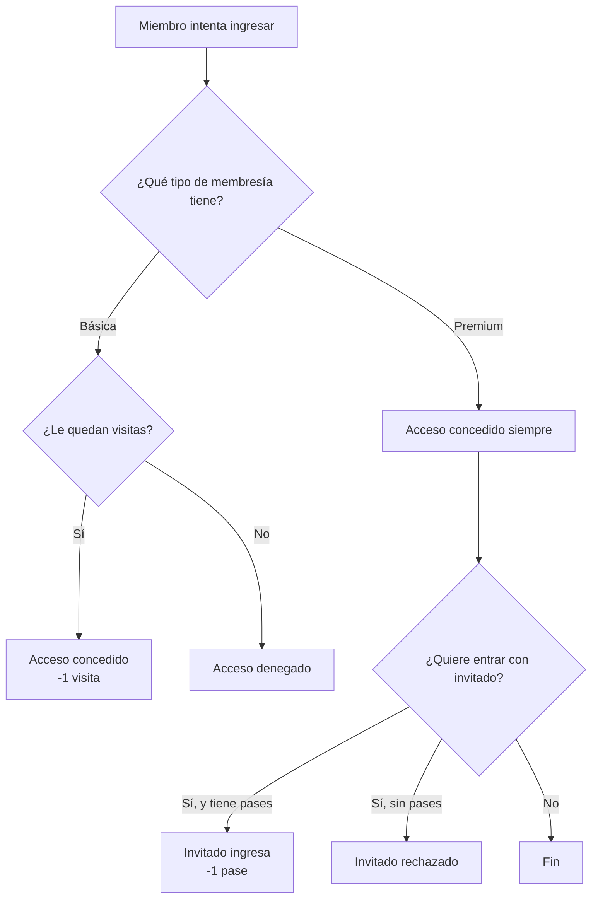

<div align="center">

# 🏋️ Gimnasio Local

**Sistema de control de acceso para gimnasio, desarrollado en Java**


</div>

---

## 📖 Descripción

`gimnasio_local` simula el control de acceso de un gimnasio para dos tipos de membresía, cada una con sus propias reglas de validación al momento de ingresar.

| Membresía | Regla de acceso |
|---|---|
| 🎫 **Básica** | Solo puede entrar si le quedan visitas disponibles |
| ⭐ **Premium** | Siempre puede entrar, y además puede traer invitados si le quedan pases |

---

## 📂 Estructura

```
gimnasio_local/
├── src/
│   ├── Membresia.java
│   ├── MembresiaBasica.java
│   ├── MembresiaPremium.java
│   └── main.java
└── gimnasio_local.iml
```

---

## ⚙️ Cómo funciona



Cada tipo de membresía decide por sí mismo si concede el acceso; el resto del programa no necesita saber qué tipo de membresía está evaluando, solo pide "verifica el acceso" y cada una responde a su manera.

---

## ✅ Validaciones y casos de uso

### Membresía Básica

| Visitas restantes antes | Acción | Resultado | Visitas después |
|---|---|---|---|
| 2 | Intenta entrar | ✅ Acceso concedido | 1 |
| 1 | Intenta entrar | ✅ Acceso concedido | 0 |
| 0 | Intenta entrar | ❌ Acceso denegado | 0 |

**Ejemplo — sin visitas disponibles:**
```
Id: 1
Nombre: Diego

Verificando Acceso
Acceso denegado
Sin visitas restantes
```

**Ejemplo — con visitas disponibles:**
```
Id: 1
Nombre: Diego

Verificando Acceso
¡Bienvenido!
Visitas restantes: 1
```

> ⚠️ La validación se basa únicamente en que `visitasRestantes > 0`. Si el contador llega a 0, ningún intento posterior vuelve a conceder el acceso hasta que se recargue manualmente (no existe recarga automática en el código actual).

---

### Membresía Premium

| Pases de invitado antes | Acción | Resultado | Pases después |
|---|---|---|---|
| — | Miembro intenta entrar | ✅ Siempre concedido | — |
| 1 | Intenta entrar con invitado | ✅ Invitado pasa | 0 |
| 0 | Intenta entrar con invitado | ❌ Invitado rechazado | 0 |

**Ejemplo — acceso del titular (nunca falla):**
```
Id: 2
Nombre: Rosario

Verificando Acceso
Usuatrio premium
¡Bienvenido!
```

**Ejemplo — invitado con pases disponibles:**
```
Verificando si puede ingresar con invitado
¡Bienvenidos pueden pasar!
Pases de invitados restantes: 0
```

**Ejemplo — invitado sin pases disponibles:**
```
Verificando si puede ingresar con invitado
Sin pases de invitados restantes
```

> ℹ️ A diferencia de la membresía Básica, el acceso del titular Premium **no depende de ningún contador**: la validación de pases solo aplica a los invitados, no al miembro mismo.

---

### Comportamiento mixto (ejecución real de `main`)

Con una lista que contiene una membresía Básica sin visitas y una Premium sin pases, la salida completa es:

```
Id: 1
Nombre: Diego

Verificando Acceso
Acceso denegado
Sin visitas restantes

Id: 2
Nombre: Rosario

Verificando Acceso
Usuatrio premium
¡Bienvenido!
Verificando si puede ingresar con invitado
Sin pases de invitados restantes
```

Esto muestra el punto clave del diseño: **el mismo bucle `for` trata a ambas membresías de forma idéntica**, y es cada objeto el que decide internamente si el acceso (o el ingreso del invitado) se concede o se rechaza.

---

## ⚙️ Requisitos

- JDK 8 o superior

## ▶️ Ejecución

**Terminal**
```bash
cd src
javac *.java
java main
```

**IntelliJ IDEA**

Abre la carpeta del proyecto y ejecuta `main.java`.

---

<div align="center">

**Diego** · Ingeniería en Software · Universidad Veracruzana

</div>